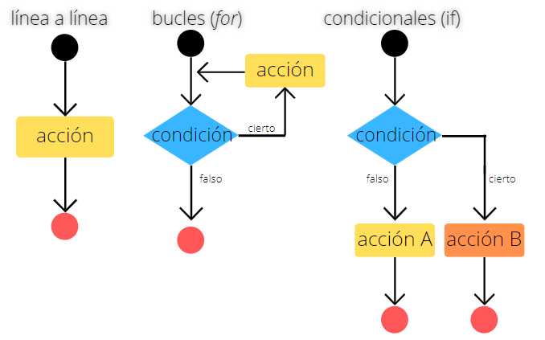

# Introducción al script en Bash

## ¿Qué es un script?
Un script es un archivo de texto con código y comentarios, algo así: 

```

#Frutas test
#Brenda, Agosto 2020

#Le pido al usuario que tipee una fruta 
echo "Escribe una fruta"
read fruta

#Si la fruta es manzana imprimirá mensajes
if [ $fruta = manzana ]
        then echo "yummie, me gustan las manzanas"
        else echo "iuuugh, asco!"
fi
```

## ¿Cómo hago un script en Bash?
Escribir los comandos a un archivo de texto (escribir el script).
Indicarle al sistema operativo (computadora) que programa (lenguaje) debe utilizar para interpretar los comandos
Darle al archivo los permisos que necesita para poder ser ejecutado por Shell.

